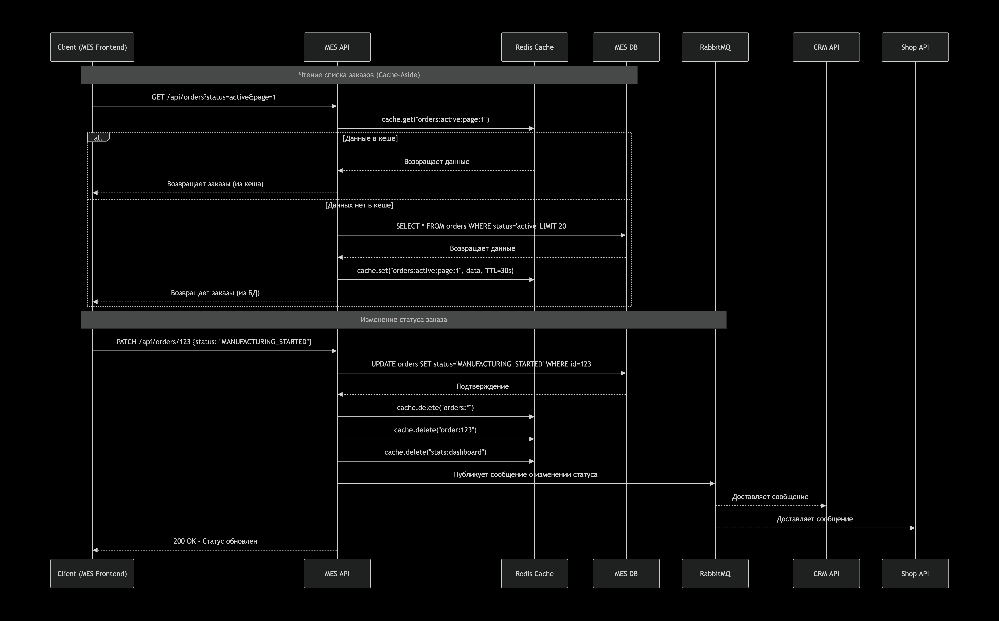

# Архитектурное решение по кешированию

## 1. Анализ системы и целевые области для кеширования

Проблемные зоны, требующие кеширования:

Дашборд MES - список заказов с фильтрами и пагинацией

    Текущая проблема: долгая загрузка (операторы жалуются)
    Частота запросов: высокая (каждые несколько секунд операторами)
    Данные: статические в течение короткого периода

Расчёт стоимости заказа

    Текущая проблема: 2-30 минут на расчёт
    Особенность: тяжёлые вычисления, зависят от сложности модели
    Возможность кеширования: результаты расчёта для одинаковых (похожих) моделей

Каталог товаров и услуг

    Частота запросов: высокая (постоянные обращения из интернет-магазина)
    Данные: относительно статические (изменяются редко)
    Текущая проблема: лишняя нагрузка на БД

Статусы заказов и агрегированные метрики

    Частота: средняя (обновление каждые несколько минут)
    Данные: часто запрашиваются для отчётов

## 2. Мотивация

**Почему кеширование необходимо:**

Бизнес-проблемы, которые решит кеширование:

- Низкая скорость работы MES - операторы не могут эффективно работать
- Медленный расчёт стоимости - клиенты уходят из-за долгого ожидания
- Низкая производительность под нагрузкой - система не масштабируется линейно
- Высокая нагрузка на базы данных - риск сбоя критических компонентов

Что даст внедрение кеширования:

- Ускорение загрузки MES в 5-10 раз (с 5-10 секунд до <1 секунды)
- Снижение времени расчёта стоимости с 30 минут до секунд для повторяющихся моделей
- Увеличение пропускной способности системы
- Снижение нагрузки на БД
- Улучшение пользовательского опыта для всех категорий пользователей

**Элементы системы для кеширования:**

MES:

    Списки заказов с фильтрами
    Агрегированные метрики по операторам
    Статистика производства

Shop API:

    Каталог товаров и услуг
    Цены (кроме персональных скидок)
    Статические данные (материалы, размеры)

Расчёт стоимости:

    Результаты расчётов для похожих 3D-моделей
    Промежуточные результаты сложных вычислений

CRM:

    Списки клиентов с основными данными
    История заказов (для быстрого доступа)

## 3. Предлагаемое решение

**Выбор типа кеширования:**

Серверное кеширование (основное решение)

Почему серверное, а не клиентское:

- Контроль над данными - возможность централизованного управления
- Согласованность данных - все клиенты получают одинаковые данные
- Снижение нагрузки на бэкенд - главная цель решения
- Сложность клиентского кеширования в многоуровневой архитектуре

Дополнительное клиентское кеширование:

- Для статических ресурсов (изображения, CSS, JS)
- Через CDN для глобального распространения
- LocalStorage для пользовательских предпочтений

Выбор паттерна кеширования: Cache-Aside

Сравнение паттернов:

| Паттерн | Преимущества | Недостатки | Применимость в отношении "Александрит" |
|---------|--------------|------------|----------------------------------------|
| **Cache-Aside** | Простая реализация, отказоустойчивость, контроль над данными | Возможность неактуальных данных, два запроса при промахе | **ЛУЧШИЙ ВЫБОР** - большинство запросов читающие |
| **Write-Through** | Консистентность данных, защита от потери | Более медленная запись, сложнее реализация | Подходит для критичных данных (статусы заказов) |
| **Write-Behind** | Максимальная производительность записи | Риск потери данных при сбое, сложная реализация | Опасно для финансовых данных |
| **Refresh-Ahead** | Минимальная задержка для пользователя | Тратит ресурсы на предзагрузку, сложность | Подходит для прогнозируемых данных |

Почему выбрали Cache-Aside:

- Простота реализации - критично для маленькой команды
- Отказоустойчивость - при падении кеша система продолжает работать
- Преобладание операций чтения - 80/20 в пользу чтения
- Гибкость инвалидации - можно комбинировать с другими стратегиями

Диаграмма последовательности действий

Стратегия инвалидации кеша

Комбинированная стратегия:

1. Временная инвалидация (TTL) - основной механизм:

        Короткий TTL (30 секунд) для часто меняющихся данных (списки заказов)
        Средний TTL (5 минут) для редко меняющихся данных (каталог товаров)
        Длинный TTL (1 час) для статических данных (справочники)

2. Инвалидация по событиям:

        При изменении заказа -> удаление кеша этого заказа и связанных списков
        При изменении цены -> удаление кеша каталога
        При действиях оператора -> удаление кеша дашборда

3. Паттерн "tag-based invalidation":

        # Ключи кеша с тегами
        key = "orders:active:page:1"
        tags = ["order_list", "user:456", "status:active"]

        # При изменении заказа
        cache.delete_by_tag("order_list")  # Удаляет все списки заказов

Почему комбинированная стратегия лучше:

| Стратегия | Преимущества | Недостатки | Почему не подходит как единственная |
|-----------|--------------|------------|-------------------------------------|
| **Только TTL** | Простота, нет риска утечек памяти | Неактуальные данные | Клиенты получают устаревшие данные о заказах |
| **Только по событиям** | Актуальность данных | Сложность, риск пропуска событий | Легко забыть инвалидировать какой-то ключ |
| **Только LRU** | Автоматическое управление памятью | Нет контроля над важными данными | Критичные данные могут быть вытеснены |
| **Комбинированная** | **Баланс актуальности и производительности** | Более сложная реализация | **ЛУЧШИЙ ВЫБОР** - покрывает все сценарии |

## 4. Рекомендуемое решение: Redis + некоторая оптимизация БД

Почему Redis:

- Наиболее сбалансированный вариант для текущих потребностей
- Соответствует компетенциям команды - есть опыт работы с похожими технологиями
- Покрывает все сценарии кеширования в системе
- Интегрируется с существующим стеком мониторинга (Prometheus, Grafana)
- Имеет четкую roadmap развития - кластеризация, персистентность, гео-репликация

Дополнительные рекомендации:

Поэтапное внедрение:

- Этап 1: Кеширование дашборда MES (самая критичная проблема)
- Этап 2: Кеширование расчёта стоимости (самое большое ускорение для клиентов)
- Этап 3: Кеширование каталога товаров (снижение нагрузки на БД)
- Этап 4: Кеширование агрегированных данных и отчётов

Комбинированный подход:

- Redis для распределённого кеша
- Оптимизация запросов PostgreSQL (индексы, материализованные представления)
- CDN для статических ресурсов фронтенда
- Локальный кеш в приложениях для данных, специфичных для инстанса

Мониторинг и настройка:

- Мониторинг hit/miss ratio (цель: >90% hit rate)
- Настройка TTL в зависимости от типа данных
- Автоматическое очищение устаревших ключей
- Алёртинг при аномалиях в работе кеша

Ожидаемые результаты:

- Ускорение MES (загрузка <1 секунды)
- Снижение времени расчёта стоимости с 30 минут до <1 секунды для похожих моделей
- Увеличение пропускной способности системы в 3-5 раз
- Снижение нагрузки на БД на 70-80%
- Повышение удовлетворённости клиентов и операторов

Это решение обеспечит быстрый эффект при разумных затратах и создаст основу для дальнейшего масштабирования системы по мере роста бизнеса.